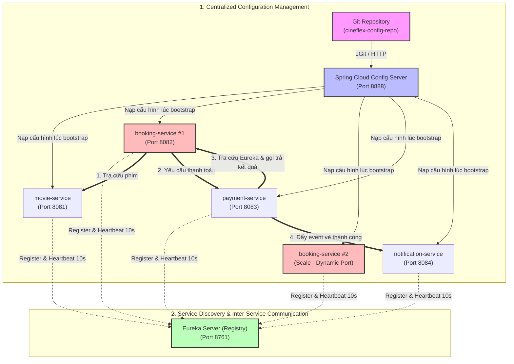

# TÀI LIỆU THIẾT KẾ HẠ TẦNG CẤU HÌNH TẬP TRUNG (SPRING CLOUD CONFIG) VÀ KHÁM PHÁ DỊCH VỤ (EUREKA SERVER)
## HỆ THỐNG ĐẶT VÉ XEM PHIM TRỰC TUYẾN — CINEFLEX

---

### 1. Giới thiệu Hệ thống & 4 Microservices Nghiệp vụ

**CineFlex** là hệ thống nền tảng phân tán phục vụ đặt vé xem phim trực tuyến đa cụm rạp theo thời gian thực. Hệ thống được module hóa thành 4 core microservices độc lập, đòi hỏi tính sẵn sàng cao, khả năng co giãn linh hoạt (auto-scaling) và quản lý cấu hình tập trung, bảo mật.

#### Bảng tổng hợp 4 Core Microservices & Cấu hình Quản lý Tập trung

| Microservice | Trách nhiệm nghiệp vụ | Cấu hình quản lý tập trung (Tối thiểu 3 giá trị) | Ý nghĩa nghiệp vụ |
| :--- | :--- | :--- | :--- |
| **`movie-service`** | Quản lý danh mục phim, diễn viên, cụm rạp, phòng chiếu và suất chiếu. | 1. `spring.datasource.url`<br>2. `movie.cache.ttl-seconds`<br>3. `external.tmdb.api-key` | • Tách biệt database môi trường Dev/Prod.<br>• TTL bộ nhớ đệm Redis lưu danh sách phim hot tránh nghẽn DB.<br>• API Key mã hóa `{cipher}` kết nối cổng dữ liệu quốc tế TMDB. |
| **`booking-service`** | Quản lý giỏ hàng, chọn ghế, giữ ghế thời gian thực và tạo đơn đặt vé. | 1. `spring.datasource.url`<br>2. `booking.hold-timeout-minutes`<br>3. `feature.seat-lock.enabled` | • Kết nối DB chứa đơn hàng và trạng thái ghế.<br>• Thời gian giữ ghế tạm thời (hold timeout) trước khi thanh toán.<br>• Feature flag bật/tắt cơ chế Distributed Lock chống trùng ghế. |
| **`payment-service`** | Xử lý thanh toán qua VNPay/MoMo/ZaloPay, quản lý hoàn tiền và đối soát. | 1. `spring.datasource.url`<br>2. `payment.gateway.timeout-ms`<br>3. `payment.retry.max-attempts` | • Kết nối DB lưu trữ lịch sử giao dịch và biên lai.<br>• Giới hạn thời gian timeout khi gọi cổng thanh toán bên thứ ba.<br>• Số lần thử lại tối đa (retry) khi mạng gặp sự cố tạm thời. |
| **`notification-service`** | Phát hành vé điện tử (QR Code) qua Email và gửi mã OTP/SMS qua Brandname. | 1. `spring.mail.host`<br>2. `notification.sms.provider-url`<br>3. `notification.queue.concurrency` | • Cấu hình SMTP server gửi mail kèm mã QR vào rạp.<br>• Endpoint tích hợp tổng đài gửi SMS OTP xác thực.<br>• Số worker xử lý song song các tác vụ gửi vé từ Message Queue. |

---

### 2. Thiết kế Cấu trúc Thư mục Git Repository (`cineflex-config-repo`)

Kho lưu trữ Git tập trung được tổ chức theo chuẩn quy ước `{application-name}-{profile}.yml` của **Spring Cloud Config Server**. 

```
cineflex-config-repo/
├── application.yml                 # Cấu hình chung hệ thống (Eureka client, Actuator, Common timeout)
├── movie-service-dev.yml           # Cấu hình môi trường DEV của movie-service
├── movie-service-prod.yml          # Cấu hình môi trường PROD của movie-service
├── booking-service-dev.yml         # Cấu hình môi trường DEV của booking-service
├── booking-service-prod.yml        # Cấu hình môi trường PROD của booking-service
├── payment-service-dev.yml         # Cấu hình môi trường DEV của payment-service
├── payment-service-prod.yml        # Môi trường PROD của payment-service
├── notification-service-dev.yml    # Môi trường DEV của notification-service
└── notification-service-prod.yml   # Môi trường PROD của notification-service
```

#### Quy tắc nạp cấu hình và Bảo mật:
1. **Thứ tự ưu tiên nạp (Override Hierarchy):**
   `application.yml` (chung) $\rightarrow$ `{application-name}.yml` $\rightarrow$ `application-{profile}.yml` $\rightarrow$ `{application-name}-{profile}.yml` (mức ưu tiên cao nhất, ghi đè các cấu hình chung).
2. **Bảo mật thông tin nhạy cảm:** Mật khẩu database, API Key đối tác bên thứ ba và Secret Token thanh toán đều được mã hóa bằng thuật toán mã hóa đối xứng/bất đối xứng của Spring Cloud Config với tiền tố `{cipher}`. Ngay cả khi mã nguồn repo Git bị lộ, dữ liệu mật vẫn an toàn.

---

### 3. Chi tiết Nội dung Từng File Cấu hình trong Repository

#### 3.1. File `application.yml` — Cấu hình dùng chung cho toàn bộ hệ thống
```yaml
# ===================================================================
# CineFlex Ecosystem - Cấu hình dùng chung kế thừa cho tất cả Service
# File: cineflex-config-repo/application.yml
# ===================================================================

server:
  tomcat:
    threads:
      max: 200
      min-spare: 20
    connection-timeout: 5000ms

spring:
  # Tích hợp Spring Cloud Config Server
  config:
    import: optional:configserver:http://localhost:8888
  cloud:
    config:
      fail-fast: false
      retry:
        max-attempts: 6
        initial-interval: 1000
        multiplier: 1.5
        max-interval: 3000

# Chiến lược Discovery Client áp dụng cho cả 4 Service khi Scale
eureka:
  client:
    service-url:
      defaultZone: http://localhost:8761/eureka/
    registry-fetch-interval-seconds: 5 # Rút ngắn chu kỳ kéo danh bạ để cập nhật instance scale nhanh chóng
  instance:
    prefer-ip-address: true
    # Đảm bảo mỗi instance khi scale động không bị ghi đè định danh
    instance-id: ${spring.application.name}:${spring.cloud.client.ip-address}:${server.port}
    lease-renewal-interval-in-seconds: 10    # Nhịp tim gửi định kỳ mỗi 10 giây
    lease-expiration-duration-in-seconds: 30 # Hủy node khỏi danh bạ sau 30 giây nếu mất tín hiệu

# Quản lý Actuator & Refresh Scope cấu hình nóng
management:
  endpoints:
    web:
      exposure:
        include: health, info, refresh, prometheus, env
  endpoint:
    health:
      show-details: always
```

---

#### 3.2. Cấu hình cho `movie-service`

##### File `movie-service-dev.yml` (Môi trường Phát triển)
```yaml
# ===================================================================
# Movie Service - Môi trường Phát triển (DEV)
# File: cineflex-config-repo/movie-service-dev.yml
# ===================================================================

server:
  port: 8081

spring:
  datasource:
    url: jdbc:mysql://localhost:3306/movies_dev_db?useSSL=false&allowPublicKeyRetrieval=true&serverTimezone=UTC
    username: movie_dev_user
    password: '{cipher}AQBA123movieDevPasswordHash456=='
    driver-class-name: com.mysql.cj.jdbc.Driver
  jpa:
    hibernate:
      ddl-auto: update
    show-sql: true
    properties:
      hibernate:
        format_sql: true

# Cấu hình nghiệp vụ Movie Service
movie:
  cache:
    ttl-seconds: 300 # DEV: Cache 5 phút thuận tiện kiểm thử cập nhật lịch chiếu phim

# Tích hợp API TMDB (The Movie Database)
external:
  tmdb:
    api-url: https://api.themoviedb.org/3
    api-key: '{cipher}AQBK872yTMDBDevApiKeySampleCipherString=='

logging:
  level:
    root: INFO
    com.cineflex.movie: DEBUG
```

##### File `movie-service-prod.yml` (Môi trường Sản xuất)
```yaml
# ===================================================================
# Movie Service - Môi trường Sản phẩm (PROD)
# File: cineflex-config-repo/movie-service-prod.yml
# ===================================================================

server:
  port: 8081

spring:
  datasource:
    url: jdbc:mysql://cineflex-db:3306/movies_db?useSSL=true&requireSSL=true&serverTimezone=Asia/Ho_Chi_Minh
    username: movie_prod_admin
    password: '{cipher}AQBL998movieProdMasterPasswordHash999=='
    driver-class-name: com.mysql.cj.jdbc.Driver
    hikari:
      maximum-pool-size: 30
      minimum-idle: 10
      idle-timeout: 30000
  jpa:
    hibernate:
      ddl-auto: validate # PROD: Tuyệt đối không tự sửa bảng
    show-sql: false

# Cấu hình nghiệp vụ Movie Service
movie:
  cache:
    ttl-seconds: 3600 # PROD: TTL 1 giờ giảm tải truy vấn cơ sở dữ liệu phim

# Tích hợp API TMDB
external:
  tmdb:
    api-url: https://api.themoviedb.org/3
    api-key: '{cipher}AQB782tmdbProductionSecretApiKeyEncryptedValue=='

logging:
  level:
    root: WARN
    com.cineflex.movie: INFO
```

---

#### 3.3. Cấu hình cho `booking-service`

##### File `booking-service-dev.yml` (Môi trường Phát triển)
```yaml
# ===================================================================
# Booking Service - Môi trường Phát triển (DEV)
# File: cineflex-config-repo/booking-service-dev.yml
# ===================================================================

server:
  port: 8082

spring:
  datasource:
    url: jdbc:mysql://localhost:3306/bookings_dev_db?useSSL=false&allowPublicKeyRetrieval=true&serverTimezone=UTC
    username: booking_dev_user
    password: '{cipher}AQBK872bookingDevPasswordSecret=='
    driver-class-name: com.mysql.cj.jdbc.Driver
  jpa:
    hibernate:
      ddl-auto: update
    show-sql: true

# Cấu hình nghiệp vụ Đặt vé & Giữ ghế
booking:
  hold-timeout-minutes: 3 # DEV: Rút ngắn 3 phút để test nhả ghế hết hạn nhanh

# Feature Flag kiểm soát tính năng khóa ghế theo thời gian thực (Distributed Lock qua Redis)
feature:
  seat-lock:
    enabled: true

logging:
  level:
    root: INFO
    com.cineflex.booking: DEBUG
```

##### File `booking-service-prod.yml` (Môi trường Sản xuất)
```yaml
# ===================================================================
# Booking Service - Môi trường Sản phẩm (PROD)
# File: cineflex-config-repo/booking-service-prod.yml
# ===================================================================

server:
  port: 8082 # Khi scale có thể chạy dynamic port (server.port=0) hoặc gán port qua biến môi trường

spring:
  datasource:
    url: jdbc:mysql://cineflex-db:3306/bookings_db?useSSL=true&requireSSL=true&serverTimezone=Asia/Ho_Chi_Minh
    username: booking_prod_admin
    password: '{cipher}AQBM554bookingProdDatabasePasswordHash=='
    driver-class-name: com.mysql.cj.jdbc.Driver
    hikari:
      maximum-pool-size: 50 # Pool lớn xử lý đặt vé đồng thời cao điểm
      minimum-idle: 15
      connection-timeout: 20000
  jpa:
    hibernate:
      ddl-auto: validate
    show-sql: false

# Cấu hình nghiệp vụ Đặt vé & Giữ ghế
booking:
  hold-timeout-minutes: 10 # PROD: Thời gian giữ ghế tiêu chuẩn 10 phút trước khi hủy thanh toán

# Feature Flag kích hoạt khóa ghế chống tranh chấp dữ liệu (Redis Redlock)
feature:
  seat-lock:
    enabled: true

logging:
  level:
    root: WARN
    com.cineflex.booking: INFO
```

---

#### 3.4. Cấu hình cho `payment-service`

##### File `payment-service-dev.yml` (Môi trường Phát triển)
```yaml
# ===================================================================
# Payment Service - Môi trường Phát triển (DEV)
# File: cineflex-config-repo/payment-service-dev.yml
# ===================================================================

server:
  port: 8083

spring:
  datasource:
    url: jdbc:mysql://localhost:3306/payments_dev_db?useSSL=false&allowPublicKeyRetrieval=true&serverTimezone=UTC
    username: payment_dev_user
    password: '{cipher}AQBP112paymentDevDbPass=='
    driver-class-name: com.mysql.cj.jdbc.Driver
  jpa:
    hibernate:
      ddl-auto: update
    show-sql: true

# Cấu hình nghiệp vụ Thanh toán
payment:
  gateway:
    provider: vnpay_sandbox
    endpoint: https://sandbox.vnpayment.vn/paymentv2/vpcpay.html
    merchant-id: CINEFLEX_DEV
    secret-key: '{cipher}AQBS443vnpayDevSecretKeyEncrypted=='
    timeout-ms: 10000 # DEV: Timeout 10s đối với môi trường sandbox kiểm thử
  retry:
    max-attempts: 2
    backoff-delay-ms: 1000

logging:
  level:
    root: INFO
    com.cineflex.payment: DEBUG
```

##### File `payment-service-prod.yml` (Môi trường Sản xuất)
```yaml
# ===================================================================
# Payment Service - Môi trường Sản phẩm (PROD)
# File: cineflex-config-repo/payment-service-prod.yml
# ===================================================================

server:
  port: 8083

spring:
  datasource:
    url: jdbc:mysql://cineflex-db:3306/payments_db?useSSL=true&requireSSL=true&serverTimezone=Asia/Ho_Chi_Minh
    username: payment_prod_admin
    password: '{cipher}AQBZ889paymentProdMasterSecurePass=='
    driver-class-name: com.mysql.cj.jdbc.Driver
    hikari:
      maximum-pool-size: 40
      minimum-idle: 10
      connection-timeout: 15000
  jpa:
    hibernate:
      ddl-auto: validate
    show-sql: false

# Cấu hình nghiệp vụ Thanh toán
payment:
  gateway:
    provider: vnpay_production
    endpoint: https://pay.vnpay.vn/vpcpay.html
    merchant-id: CINEFLEX_PROD
    secret-key: '{cipher}AQBU665vnpayProductionSecretKeyEncryptedValue=='
    timeout-ms: 5000 # PROD: Giới hạn timeout 5s để giải phóng giao dịch nhanh
  retry:
    max-attempts: 3 # PROD: Tự động retry tối đa 3 lần cho sự cố mạng tạm thời
    backoff-delay-ms: 1500

logging:
  level:
    root: WARN
    com.cineflex.payment: INFO
```

---

#### 3.5. Cấu hình cho `notification-service`

##### File `notification-service-dev.yml` (Môi trường Phát triển)
```yaml
# ===================================================================
# Notification Service - Môi trường Phát triển (DEV)
# File: cineflex-config-repo/notification-service-dev.yml
# ===================================================================

server:
  port: 8084

spring:
  mail:
    host: smtp.sendgrid.net
    port: 587
    username: apikey
    password: '{cipher}AQBN321sendgridDevApiKeyCipherString=='
    properties:
      mail:
        smtp:
          auth: true
          starttls:
            enable: true

# Cấu hình dịch vụ Thông báo (SMS OTP & Hàng đợi gửi thông báo)
notification:
  sms:
    provider-url: https://sandbox.sms-gateway.vn/v1 # DEV: Cổng SMS sandbox mô phỏng
    api-token: '{cipher}AQBT981smsSandboxDevTokenCipher=='
  queue:
    concurrency: 2 # DEV: Khởi tạo 2 worker xử lý hàng đợi
    retry-delay-ms: 2000

logging:
  level:
    root: INFO
    com.cineflex.notification: DEBUG
```

##### File `notification-service-prod.yml` (Môi trường Sản xuất)
```yaml
# ===================================================================
# Notification Service - Môi trường Sản phẩm (PROD)
# File: cineflex-config-repo/notification-service-prod.yml
# ===================================================================

server:
  port: 8084

spring:
  mail:
    host: smtp.sendgrid.net
    port: 587
    username: apikey
    password: '{cipher}AQBF776sendgridProductionMasterApiKeySecret=='
    properties:
      mail:
        smtp:
          auth: true
          starttls:
            enable: true
          connectiontimeout: 5000
          timeout: 5000
          writetimeout: 5000

# Cấu hình dịch vụ Thông báo (SMS Brandname & Hàng đợi gửi thông báo)
notification:
  sms:
    provider-url: https://api.sms-gateway.vn/v1 # PROD: Cổng gửi tin SMS Brandname thực tế
    api-token: '{cipher}AQBW122smsProdLiveTokenEncrypted=='
  queue:
    concurrency: 5 # PROD: 5 consumer worker xử lý song song gửi vé xem phim
    retry-delay-ms: 5000

logging:
  level:
    root: WARN
    com.cineflex.notification: INFO
```

---

### 4. Chiến lược Cấu hình Eureka Server & Eureka Client Khi Scale Đa Instance

#### 4.1. Cấu hình Eureka Server (`discovery-server`)
Eureka Server đóng vai trò Registry danh bạ trung tâm ghi nhận vị trí IP và Port của mọi microservice.

```yaml
# ===================================================================
# Eureka Discovery Server
# File: discovery-server/src/main/resources/application.yml
# ===================================================================

server:
  port: 8761

eureka:
  instance:
    hostname: localhost
  client:
    # Eureka Server độc lập không cần tự đăng ký chính nó
    register-with-eureka: false
    fetch-registry: false
    service-url:
      defaultZone: http://${eureka.instance.hostname}:${server.port}/eureka/
  server:
    # Tắt chế độ tự bảo vệ ở môi trường Dev/Test hoặc bật kiểm soát chặt ở Prod
    enable-self-preservation: false 
    eviction-interval-timer-in-ms: 5000 # Quét dọn các instance quá hạn heartbeat định kỳ 5 giây
```

#### 4.2. Chiến lược xử lý khi Scale đa instance (Ví dụ: `booking-service` scale từ 1 $\rightarrow$ 4 instances)
Khi mở bán vé các bộ phim bom tấn, lưu lượng đặt chỗ tăng đột biến, `booking-service` được scale lên 4 instances chạy song song. Để đảm bảo vận hành trơn tru, các giải pháp kỹ thuật sau được áp dụng:

1. **Cơ chế Định danh Duy nhất (Dynamic `instance-id`):**
   ```yaml
   eureka.instance.instance-id: ${spring.application.name}:${spring.cloud.client.ip-address}:${server.port}
   ```
   *Nguyên lý:* Mặc định Eureka sử dụng hostname làm ID. Nếu chạy nhiều instance trên cùng một máy chủ hoặc cluster Kubernetes chia sẻ IP, các instance sẽ ghi đè nhau. Bằng cách kết hợp `ip-address` và `server.port` (kèm dynamic port `server.port=0`), mỗi instance luôn có một mã định danh duy nhất trong Registry.

2. **Rút ngắn thời gian phát hiện và dọn dẹp node (Heartbeat & Eviction):**
   - `lease-renewal-interval-in-seconds: 10`: Client gửi nhịp tim (heartbeat) lên Eureka Server mỗi 10 giây (nhanh hơn mặc định 30 giây).
   - `lease-expiration-duration-in-seconds: 30`: Nếu sau 30 giây Eureka Server không nhận được heartbeat, server sẽ đánh dấu instance đã chết và loại bỏ khỏi danh bạ (nhanh hơn mặc định 90 giây).

3. **Cập nhật danh bạ tức thời ở phía Consumer (Fast Registry Fetching):**
   - `registry-fetch-interval-seconds: 5`: Các service consumer (`payment-service`, `api-gateway`) chỉ mất tối đa 5 giây để kéo danh sách 4 instance mới của `booking-service`, giúp điều phối tải (Load Balancing) ngay lập tức mà không gửi request vào node cũ đã tắt.

4. **Tắt chế độ Self-Preservation (`enable-self-preservation: false`):**
   - Khi scale giảm (scale in) đột ngột từ 4 về 1 instance, Eureka có thể lầm tưởng là sự cố mạng cục bộ và giữ lại các instance "ma". Việc tắt self-preservation giúp giải phóng danh bạ sạch sẽ.

---

### 5. Sơ đồ Kiến trúc & Luồng Dữ liệu Tổng thể (Architecture & Data Flow Diagram)

#### 5.1. Sơ đồ luồng dữ liệu (Mermaid Flowchart)



---

#### 5.2. Sơ đồ kiến trúc toàn cảnh (ASCII Diagram)

```
=============================================================================================================
                                      HẠ TẦNG CINEFLEX MICROSERVICES
=============================================================================================================

 [ Git Repository: cineflex-config-repo ]
       │  (application.yml, *-dev.yml, *-prod.yml)
       ▼  [Git Webhook / JGit Polling]
 ┌───────────────────────────────────────────────────────────┐
 │               Spring Cloud Config Server                  │  Port: 8888
 │           (Giải mã {cipher} & Cung cấp REST API)          │
 └─────────────────────────────┬─────────────────────────────┘
                               │ HTTP Fetch Config lúc khởi động
         ┌─────────────────────┼─────────────────────┬─────────────────────┐
         ▼                     ▼                     ▼                     ▼
 ┌───────────────┐     ┌───────────────┐     ┌───────────────┐     ┌───────────────┐
 │ movie-service │     │booking-service│     │payment-service│     │ notification- │
 │  (Port 8081)  │     │ (Scale x1..4) │     │  (Port 8083)  │     │    service    │
 └───────┬───────┘     └───────┬───────┘     └───────┬───────┘     │  (Port 8084)  │
         │                     │                     │             └───────┬───────┘
         │ Đăng ký (Register)  │ Đăng ký (Register)  │ Đăng ký             │ Đăng ký
         │ Nhịp tim (10s)      │ Nhịp tim (10s)      │ Nhịp tim (10s)      │ Nhịp tim (10s)
         ▼                     ▼                     ▼                     ▼
 ┌─────────────────────────────────────────────────────────────────────────────────┐
 │                           Eureka Server (Service Registry)                      │  Port: 8761
 │       (Lưu trữ danh bạ: IP, Port, Instance ID, Trạng thái UP/DOWN của Service)  │
 └─────────────────────────────────────┬───────────────────────────────────────────┘
                                       │
                      Service Discovery Lookup & Load Balancing
                      (Spring Cloud LoadBalancer / OpenFeign)
                                       ▼
 ┌─────────────────────────────────────────────────────────────────────────────────┐
 │                               Luồng Nghiệp vụ Gọi Liên Service                 │
 │                                                                                 │
 │  1. Khách chọn phim & rạp     : booking-service  ──(HTTP/Feign)──> movie-service│
 │  2. Khách thanh toán đơn vé   : booking-service  ──(HTTP/Feign)──> payment-serv │
 │  3. Xác nhận & xuất vé QR     : payment-service  ──(Event/Queue)─> notification │
 └─────────────────────────────────────────────────────────────────────────────────┘
=============================================================================================================
```

---

### 6. Phân tích Hai Luồng Vận hành Cốt lõi

#### Luồng 1: Quản lý Cấu hình Tập trung (Centralized Configuration Flow)
1. **Khởi động Service:** Khi `booking-service` khởi động với VM options `-Dspring.profiles.active=prod`:
2. **Gọi Config Server:** Service đọc cấu hình bootstrap, gửi request HTTP GET tới `http://localhost:8888/booking-service/prod`.
3. **Tổng hợp & Giải mã:** Config Server đọc file `application.yml` (dùng chung) và `booking-service-prod.yml` từ Git repo, giải mã các giá trị `{cipher}` (như mật khẩu DB) bằng Private Key, sau đó trả về payload JSON chứa đầy đủ thuộc tính đã hợp nhất.
4. **Cập nhật không Downtime (Zero Downtime Refresh):** Khi thay đổi `booking.hold-timeout-minutes` trên Git, DevOps chỉ cần gọi POST `/actuator/refresh` tới các instance đang chạy, annotation `@RefreshScope` sẽ tự động tải lại giá trị mới mà không phải build hay restart container.

#### Luồng 2: Khám phá Dịch vụ & Giao tiếp (Service Discovery & Communication Flow)
1. **Đăng ký (Registration):** Ngay khi `booking-service` khởi động xong, nó gửi bản tin HTTP POST tới `http://localhost:8761/eureka/apps/BOOKING-SERVICE` với payload chứa `instance-id`, IP và Port.
2. **Giữ kết nối (Heartbeat):** Cứ mỗi 10 giây, client gửi một bản tin PUT (heartbeat) để thông báo instance vẫn hoạt động bình thường.
3. **Tra cứu & Cân bằng tải (Discovery & Load Balancing):** Khi `payment-service` cần xác thực thông tin đơn vé từ `booking-service`, Feign Client sẽ hỏi Eureka danh sách các instance có tên `BOOKING-SERVICE`. Eureka trả về danh sách 4 IP/Port. Spring Cloud LoadBalancer tự động áp dụng thuật toán Round-Robin để định tuyến tải đều cho 4 instance.
4. **Hủy đăng ký & Scale Down:** Khi tắt bớt 3 instance `booking-service`, tín hiệu shutdown kích hoạt hook gửi DELETE request hủy đăng ký tới Eureka; nếu server chết đột ngột, sau 30 giây cơ chế eviction timer sẽ tự động xóa instance đó khỏi danh bạ.